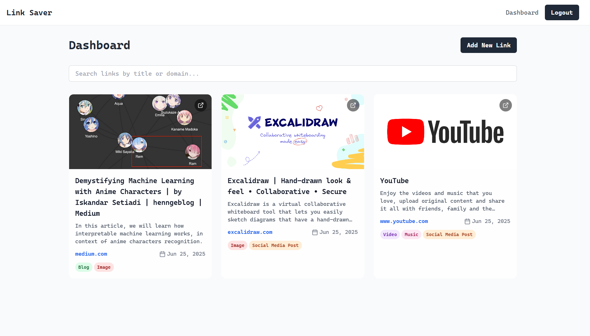

# AI Link Saver

An intelligent link saving application that uses AI to automatically summarize and categorize your links.



## Features

- **User Authentication**: Secure registration and login with JWT. Includes password confirmation for new accounts.
- **Save & Analyze**: Save any URL, and the app will automatically fetch the title, description, and a relevant image.
- **AI-Powered Summaries**: Google Gemini AI generates a concise summary of every link you save.
- **AI-Powered Tagging**: Links are automatically categorized for easy discovery.
- **Clean Dashboard**: View all your saved links in a clean, minimalist dashboard.
- **Search Functionality**: Instantly search through your saved links by title or domain.
- **Modern UI**: A clean, light-themed, and responsive interface built with React and Tailwind CSS.
- **Landing Page**: A beautiful and welcoming landing page for new users.

## Technology Stack

- **Frontend**: React, TypeScript, React Router, Tailwind CSS, Axios
- **Backend**: Node.js, Express, PostgreSQL
- **AI**: Google Gemini
- **Authentication**: JWT, bcrypt

## Setup

### 1. Prerequisites
- [Node.js](https://nodejs.org/) (v18 or later recommended)
- A PostgreSQL database. You can use a free provider like [Neon](https://neon.tech/).

### 2. Configure Environment Variables
1.  In the root of the project, create a file named `.env`.
2.  Copy the contents of `.env.example` into your new `.env` file.
3.  Fill in the values in your `.env` file:
    - `DATABASE_URL`: Your full PostgreSQL connection string.
    - `GEMINI_API_KEY`: Your API key from [Google AI Studio](https://ai.google.dev/).
    - `JWT_SECRET`: A long, random string for signing tokens. You can generate one [here](https://generate-secret.now.sh/32).
    - `PORT`: The port for the backend server (defaults to 3001).

### 3. Install & Run
1.  Install dependencies for both the root and the `server` directory:
    ```bash
    npm install
    ```
2.  Start the frontend and backend servers:
    - To run the backend server (on port 3001):
      ```bash
      npm run server
      ```
    - To run the frontend dev server (on port 5173):
      ```bash
      npm run dev
      ```

Your application should now be running. Open your browser to the frontend URL to see the landing page.

## API Endpoints

### Authentication
- `POST /api/auth/register` - Register new user
- `POST /api/auth/login` - User login
- `GET /api/auth/me` - Get current user info

### Links
- `POST /api/links` - Save a new link
- `GET /api/links` - Get all user's links
- `GET /api/links/:id` - Get specific link details
- `DELETE /api/links/:id` - Delete a link

## Features in Detail

### Link Processing Pipeline
1. **URL Validation**: Ensures valid URL format
2. **Metadata Extraction**: Fetches page title, description, and Open Graph image
3. **AI Analysis**: Gemini AI analyzes content for tagging and summarization
4. **Database Storage**: Saves all data with user association

### Security Features
- Password hashing with bcrypt
- JWT token authentication
- Protected API routes
- SQL injection prevention with parameterized queries

### User Experience
- Real-time search and filtering
- Responsive grid and list views
- Smooth loading states
- Error handling with user feedback
- Optimistic UI updates

## Deployment

For production deployment:

1. Set up your PostgreSQL database
2. Configure environment variables on your hosting platform
3. Build the frontend: `npm run build`
4. Deploy both frontend and backend
5. Set up SSL certificates for secure connections

## Contributing

1. Fork the repository
2. Create a feature branch
3. Make your changes
4. Test thoroughly
5. Submit a pull request

## License

This project is licensed under the MIT License.
